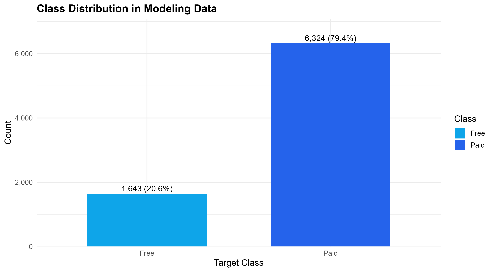
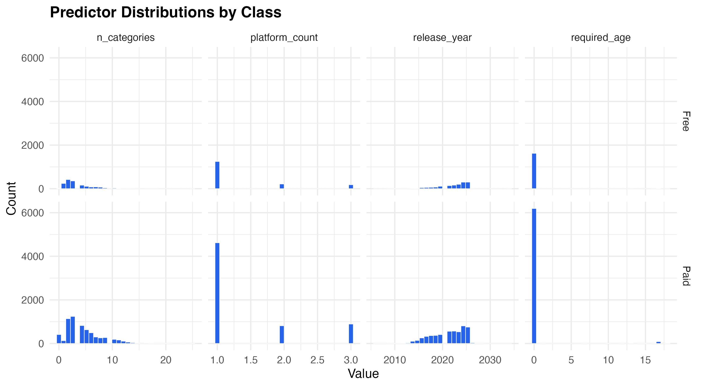
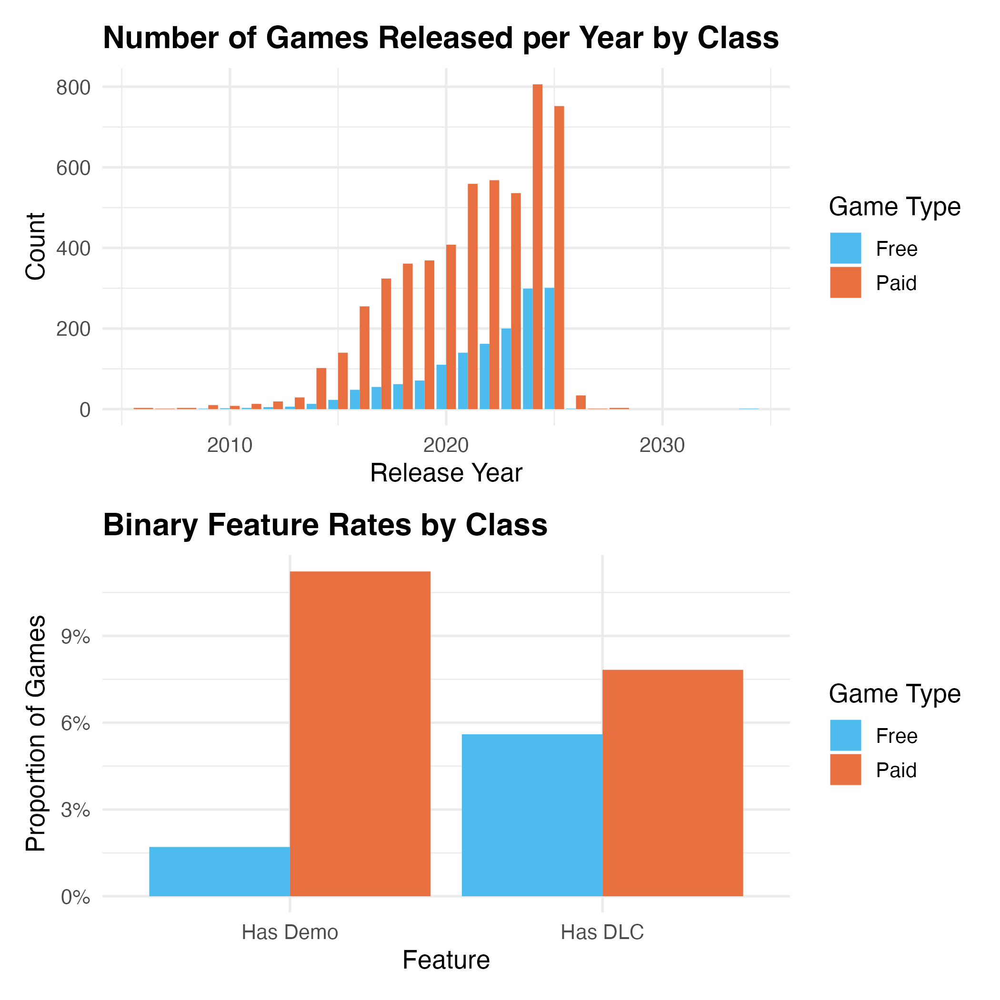
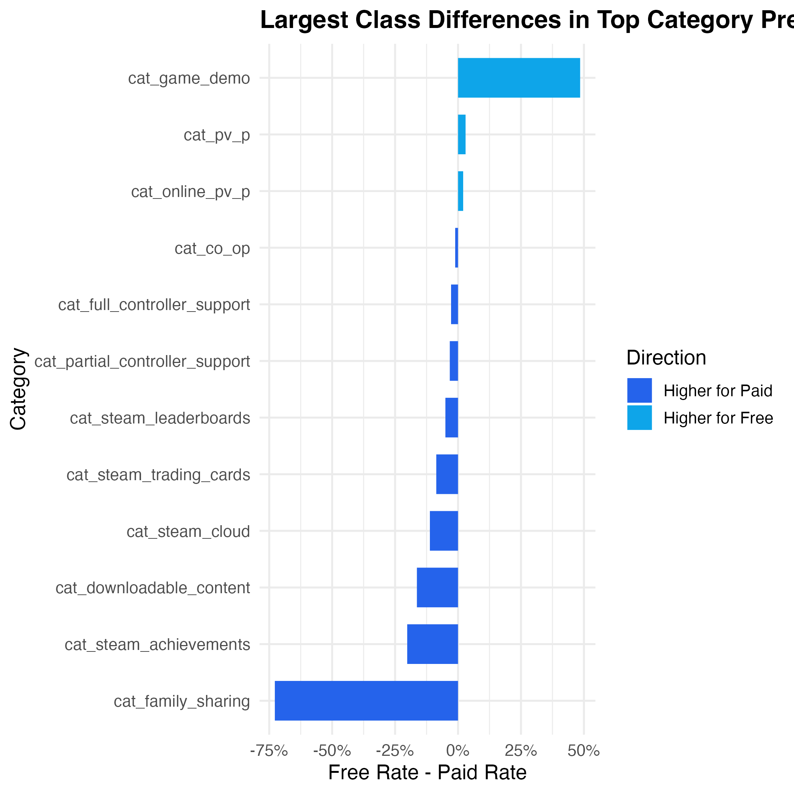
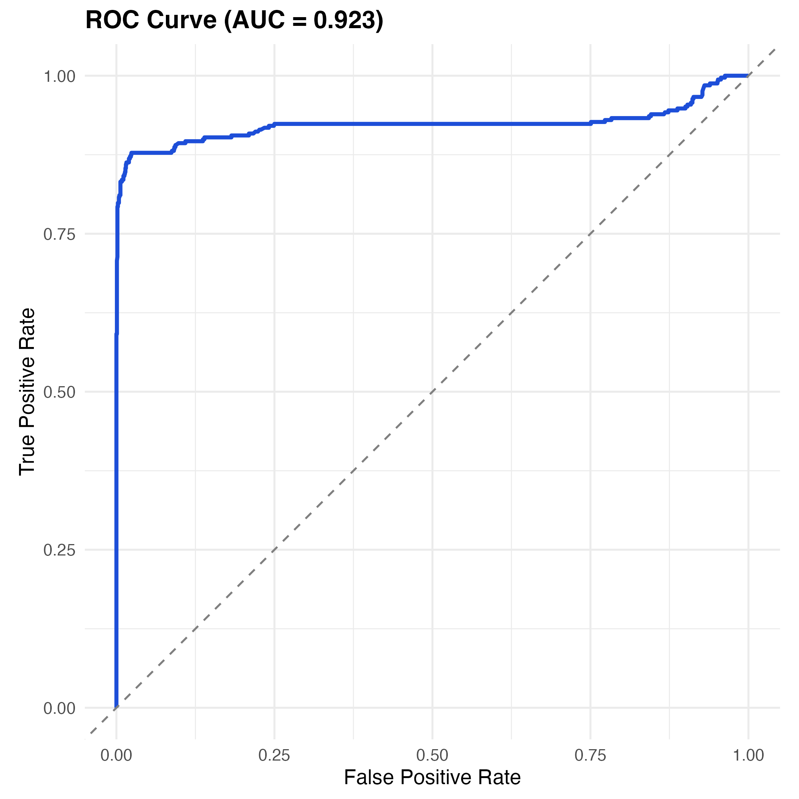
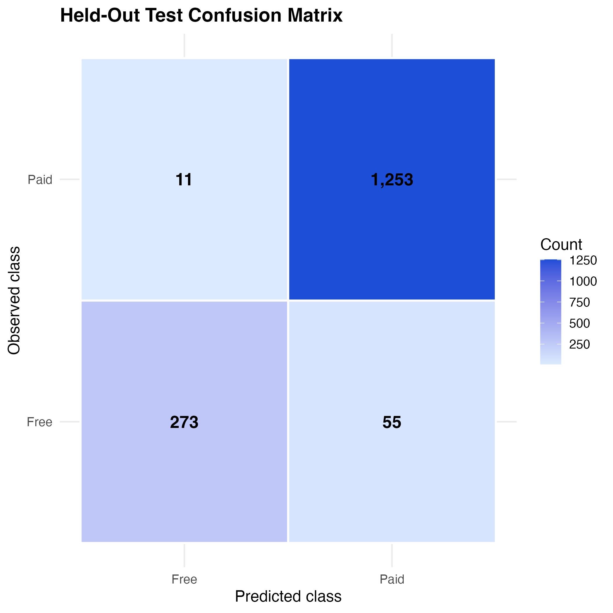

```{r}
#| message: false
#| warning: false
library(tidyverse)
library(scales)
library(knitr)
```

# Summary

This project uses machine learning to predict whether a Steam game is free-to-play
or paid based on its attributes. Using a snapshot of approximately 5,000 Steam games
collected in August 2025 (@vintagedon2025dataset), we train a cross-validated logistic
regression classifier. The final model achieves 95.9% accuracy and a ROC AUC of 0.923
on the held-out test set, substantially outperforming a majority-class baseline of 79.4%.

# Introduction

Steam is the world's largest PC game distribution platform, with over 10,000 annual
releases (@statista2026steam) and around 20 million daily active users (@steam_charts).
Being able to predict whether a game will be free or not helps developers make pre-launch
pricing decisions, helps publishers evaluate projects, and helps researchers study
quality signals in large content marketplaces.

The dataset used is the Steam 2025 5K Games Dataset (@vintagedon2025dataset): a
gzip-compressed JSON snapshot of approximately 5,000 Steam game records taken on
August 31, 2025. Key fields include `steam_appid`, `name`, `is_free` (the target
variable), `genres`, `categories`, `platforms`, `release_date`, `required_age`, and
`developer`.

Specifically, we ask:

1. What game attributes differ most between free-to-play and paid titles?
2. Can a machine learning classifier accurately distinguish free and paid games using
   only pre-launch observable features?
3. Which features contribute most to that classification?

# Methods & Results

The R programming language (@R) and the following R packages were used to perform
the analysis: tidyverse (@tidyverse), caret (@caret), pROC (@pROC), janitor (@janitor),
lubridate (@lubridate), scales (@scales), patchwork (@patchwork), jsonlite (@jsonlite),
and Quarto (@Allaire_Quarto_2022).

Data were loaded, cleaned, and feature-engineered using `scripts/02_data-preprocessing.R`.
Column names were simplified, `is_free` was recoded as a two-level factor, platform
flags were cast to logical and summed into `platform_count`, and the top 15 most-frequent
game categories were one-hot encoded as indicator columns. Missing values were imputed
with sensible defaults, keeping data loss below 10%.

## Data Validation

<!-- The pipeline runs data validation before the wrangled table is used for plots or
modeling. Structural checks fail the pipeline when the source file format, required
columns, empty observations, required missingness, data types, duplicates, value
ranges, category levels, or target distribution do not match expectations. Optional
developer/publisher metadata missingness is recorded as a warning because those fields
are not model predictors.

Correlation diagnostics are run only on the training split after stratified sampling.
This avoids using held-out test-set relationships to guide modeling decisions. 

TODO 
note that we removed perfectly (or almost perfectly, like 99.95% collinear predictors, cat_game_demo and cat_downloadable_content) -->

<!-- ```{r}
#| label: tbl-validation-summary
#| tbl-cap: "Data validation check summary by pipeline stage."
validation_summary <- bind_rows(
  read_csv("../data/data_validation_report.csv", show_col_types = FALSE),
  read_csv("../results/train_validation_report.csv", show_col_types = FALSE)
) |>
  count(stage, status, name = "n_checks") |>
  arrange(stage, status)

kable(validation_summary)
``` -->

## Exploratory Data Analysis

The dataset is heavily imbalanced: paid games account for 79.4% of records and free
games for only 20.6% (@fig-target-dist). This means a naive majority-class classifier
would already achieve ~79% accuracy, so model accuracy must be interpreted alongside
sensitivity and specificity.

{#fig-target-dist}

@fig-numeric-dist shows distributions of the four key numeric predictors. `n_categories`
is right-skewed: most games belong to just a few categories. `platform_count` clusters
at 1, reflecting that most titles are Windows-only. `release_year` rises sharply
post-2015 as Steam's catalogue expanded. `required_age` is concentrated at 0, as most
games carry no age restriction.

{#fig-numeric-dist}

@fig-feature-rel presents further feature relationships by class. Release-year
distributions are similarly shaped for both classes, but paid games dominate throughout.
The binary feature panel shows that paid games are far more likely to have DLC or a demo,
consistent with using demos to drive paid conversions.

{#fig-feature-rel}

@fig-cat-analysis shows the difference in category prevalence between free and paid
games. Single-player games strongly skew paid, while multiplayer and Steam leaderboard
games tilt slightly toward free — consistent with free-to-play titles relying on large
player pools for engagement.

{#fig-cat-analysis}

## Modeling and Evaluation

The dataset was split 80/20 into training and test sets using stratified sampling to
preserve the class ratio. A majority-class baseline — predicting "Paid" for every
observation — yields 79.4% accuracy. Logistic regression was trained using `caret`
(@caret) with 5-fold cross-validation optimising for ROC AUC. Only pre-launch observable
features were included as predictors.

Classification metrics for the model on the held-out test set are shown in @tbl-metrics.

```{r}
#| label: tbl-metrics
#| tbl-cap: "Classification metrics for the logistic regression model on the held-out test set."
metrics_tbl <- read_csv("../results/evaluation_metrics_table.csv")
kable(metrics_tbl)
```

The model improves on the baseline by 16 percentage points. Specificity is near-perfect
at 0.991, while sensitivity reaches 0.832. Cohen's Kappa of 0.867 confirms performance
well beyond chance (@cadili2015cohens). Balanced accuracy of 0.912 indicates the model
handles both classes reasonably despite the imbalance (@desilva2024balanced).

In @fig-roc we show the ROC curve, which hugs the top-left corner (AUC = 0.923),
confirming strong discriminative ability across all decision thresholds.

{#fig-roc width="65%"}

The confusion matrix in @fig-cm shows the raw prediction counts. The model correctly
identifies the vast majority of paid games, while missing a smaller proportion of free
games due to class imbalance.

{#fig-cm width="65%"}

The top 15 variable importance scores are presented in @tbl-varimp. The five most
important predictors are family sharing, single-player, Steam leaderboards, multiplayer,
and demo availability.

```{r}
#| label: tbl-varimp
#| tbl-cap: "Top 15 variable importance scores from the logistic regression model."
varimp_tbl <- read_csv("../results/feature_importances_table.csv")
kable(varimp_tbl)
```

# Discussion

The logistic regression classifier achieves strong overall performance (accuracy 0.959,
AUC 0.923), but the asymmetry between sensitivity (0.832) and specificity (0.991)
warrants careful interpretation. The model is more reliable at identifying paid games
than free ones — a consequence of the 4:1 class imbalance in the training data.

The variable importance results are counterintuitive in places. Family sharing emerges
as the single strongest predictor of a game being *free*, yet the EDA showed that paid
games have family sharing enabled more often in absolute frequency. The logistic
regression coefficient captures the conditional relationship after controlling for all
other variables, which can reverse marginal associations — a known consequence of
multivariate adjustment.

The strong influence of the single-player category on predicting *paid* games aligns
with industry convention: narrative or campaign-driven titles typically require a
purchase, whereas free-to-play games rely on multiplayer engagement and microtransactions.

An interesting follow-up analysis would be to define multiplayer sub-categories (MOBA,
MMORPG, co-op) to determine whether finer genre distinctions improve predictive power,
or to extend the target variable beyond binary free/paid to capture the full pricing
distribution.

# References
